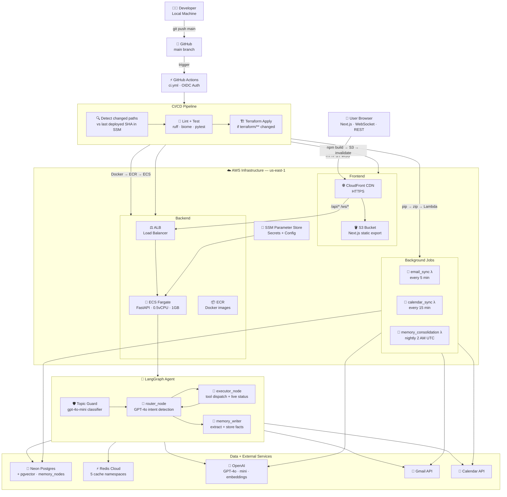

# Chief of Staff — AI Personal Assistant

An agentic AI assistant that manages your email, calendar, and institutional memory. Built with FastAPI + LangGraph + Next.js, fully deployed on AWS with automated CI/CD.


---

## What It Does

- **Chat with your inbox** — ask "any urgent emails from John?" and the agent searches Gmail, reads the email, and summarises it
- **Manage your calendar** — "schedule a meeting with Alice on Friday at 3pm" creates a Google Calendar event
- **Remembers everything** — facts, preferences, and communication style persist across sessions via a vector memory system
- **Background intelligence** — Lambda functions run every 5 minutes silently extracting knowledge from new emails and calendar events
- **Real-time streaming** — WebSocket chat with live tool status ("Checking your calendar...") so you always know what the agent is doing
- **Scope-restricted** — a two-layer guard (system prompt + gpt-4o-mini classifier) blocks off-topic questions before they hit the full agent

---

## DevOps Diagram

> 📊 **[Open Interactive DevOps Diagram](./devops-diagram.html)** — full visual architecture (open in browser)



---

## Architecture

```
┌──────────────────────────────────────────────────────────────────┐
│                        USER BROWSER                              │
│              Next.js 15 (Static Export on S3 + CloudFront)       │
└───────────────────────────┬──────────────────────────────────────┘
                            │ HTTPS / WSS
                            ▼
┌──────────────────────────────────────────────────────────────────┐
│                    AWS CloudFront (CDN)                           │
│   /  → S3 (frontend)          /api/* /ws/* → ALB (FastAPI)       │
└───────────────────────────┬──────────────────────────────────────┘
                            │
              ┌─────────────▼──────────────┐
              │  Application Load Balancer  │
              │  HTTP :80 → ECS :8000       │
              └─────────────┬──────────────┘
                            │
              ┌─────────────▼──────────────┐
              │     ECS Fargate (FastAPI)   │
              │     0.5 vCPU / 1 GB RAM     │
              │                             │
              │  REST /api/v1/  WebSocket   │
              │                 /ws/chat    │
              │                     │       │
              │         ┌───────────▼────┐  │
              │         │  LangGraph     │  │
              │         │  Agent         │  │
              │         │  router →      │  │
              │         │  executor →    │  │
              │         │  memory_writer │  │
              │         └───────────┬────┘  │
              └─────────────────────┼───────┘
                                    │
         ┌──────────────┬───────────┼───────────────┐
         │              │           │               │
┌────────▼──────┐ ┌─────▼────┐ ┌───▼──────┐ ┌─────▼──────┐
│ Neon Postgres │ │  Redis   │ │ OpenAI   │ │ Google     │
│ + pgvector    │ │  Cache   │ │ GPT-4o   │ │ Gmail +    │
│ Memory Store  │ │          │ │ Embed    │ │ Calendar   │
└───────────────┘ └──────────┘ └──────────┘ └────────────┘

┌──────────────────────────────────────────────────────┐
│           EventBridge Scheduled Triggers              │
│  email_sync (5min)  calendar_sync (15min)  mem (2AM) │
│         └──────────────┬──────────────────┘          │
│                        ▼                             │
│              AWS Lambda (Python 3.11)                │
└──────────────────────────────────────────────────────┘
```

---

## Key Implementation Highlights

### 1. LangGraph Agentic Loop

The agent is a **stateful directed graph** — not a simple prompt chain.

```
user message
     │
     ▼
router_node  ──── calls GPT-4o with tools ────► tool_calls?
     │                                               │
     │ no (final answer)                       yes  │
     ▼                                              ▼
memory_writer_node                          executor_node
     │                                       (Gmail / Calendar / Memory)
     ▼                                              │
    END                                    loop back to router
```

- **router_node** reads user *intent* not keywords — "I hate 9 AM meetings" stores a preference, never calls a tool
- **executor_node** sends live `{"type": "thinking", "content": "Checking your calendar..."}` WebSocket messages before each tool call
- **memory_writer_node** silently extracts and stores facts after every turn

### 2. Three-Tier Memory System (pgvector)

```
Every conversation turn:
  Query → text-embedding-3-small → 1536-dim vector
        → pgvector cosine similarity search (threshold 0.75)
        → top-k facts injected into system prompt

┌─────────────────┬──────────────────────────────────────────┐
│  semantic       │ Facts & preferences from chat/email       │
│  procedural     │ Communication style patterns              │
│  episodic       │ Conversation episode summaries            │
└─────────────────┴──────────────────────────────────────────┘

After every turn:
  GPT-4o extracts → facts, preferences, style_patterns, entities
  Deduplication: similarity > 0.97 → update existing, not insert
```

### 3. Redis Caching Layer (Write-Through)

Five independent cache namespaces with automatic in-memory fallback:

| Cache Key | TTL | Purpose |
|---|---|---|
| `user:{id}` | 60s | Auth user object — avoids DB hit on every request |
| `google_creds:{id}` | 50 min | OAuth tokens — avoids DB decrypt on every API call |
| `embed:{md5}` | 7 days | Embedding vectors — same text never calls OpenAI twice |
| `calendar:{id}:{days}` | 5 min | Calendar API results |
| `email:{id}:{hash}` | 2 min | Gmail search results |

All cache operations include `except asyncio.CancelledError: raise` to propagate clean shutdown signals.

### 4. Two-Layer Topic Guard

Off-topic questions are rejected before the expensive GPT-4o agent runs:

```
User message
     │
     ▼
Layer 1: gpt-4o-mini classifier  ← fast, cheap ($0.15/1M tokens)
  "what is machine learning?" → BLOCKED
  "do I have meetings tomorrow?" → ALLOWED
     │
     ▼ (only if ALLOWED)
Layer 2: System prompt OUT OF SCOPE section
     │
     ▼
Full GPT-4o agent
```

### 5. Background Lambda Workers

| Lambda | Schedule | What it does |
|---|---|---|
| `email_sync` | Every 5 min | Reads unread Gmail → gpt-4o-mini extracts facts → stores in pgvector |
| `calendar_sync` | Every 15 min | Reads 14-day calendar → stores episode summary |
| `memory_consolidation` | Nightly 2 AM | Prunes memories with importance < 0.2, caps at 1000 per user |

Lambda packages are built inside the **Lambda runtime Docker image** (`public.ecr.aws/lambda/python:3.11`) to avoid GLIBC incompatibility with the Ubuntu CI runner.

### 6. Real-Time WebSocket Streaming

```
Frontend                          Backend
   │                                 │
   │──── {"message": "..."}  ───────►│
   │                                 │ guard check (gpt-4o-mini)
   │                                 │ run agent
   │◄─── {"type":"thinking",         │ tool starting
   │       "content":"Checking..."}  │
   │◄─── {"type":"token","content"}  │ streaming response
   │◄─── {"type":"token","content"}  │
   │◄─── {"type":"done","conv_id"}   │ complete
```

Stop button (■) cancels in-flight requests client-side and preserves any partial response already streamed.

---

## Tech Stack

| Layer | Technology |
|---|---|
| **Frontend** | Next.js 15, TypeScript, Tailwind CSS, React |
| **Backend** | FastAPI, Python 3.11, asyncio, SQLAlchemy (async) |
| **Agent** | LangGraph, OpenAI GPT-4o, gpt-4o-mini |
| **Memory** | PostgreSQL + pgvector, text-embedding-3-small (1536-dim) |
| **Cache** | Redis (write-through), in-memory fallback |
| **Auth** | Google OAuth 2.0, JWT (HS256), Fernet token encryption |
| **Background Jobs** | AWS Lambda (Python 3.11), EventBridge cron |
| **Infrastructure** | AWS ECS Fargate, ALB, CloudFront, S3, ECR |
| **IaC** | Terraform (all AWS resources) |
| **CI/CD** | GitHub Actions + AWS OIDC (no static keys) |
| **Linting** | Ruff (Python), Biome (TypeScript) |

---

## AWS Infrastructure

All infrastructure is defined in `terraform/` and provisioned automatically by CI.

| Resource | Service | Details |
|---|---|---|
| Frontend CDN | CloudFront | Routes `/api/*` → ALB, `/` → S3 |
| Frontend assets | S3 | Next.js static export |
| SPA routing | CloudFront Function | Rewrites paths → `index.html` |
| Backend | ECS Fargate | 0.5 vCPU, 1 GB, single uvicorn worker |
| Container registry | ECR | 10-image lifecycle policy |
| Load balancer | ALB | Health check `/health`, HTTP→ECS:8000 |
| Database | Neon (serverless Postgres) | pgvector extension, us-east-1 |
| Cache | Redis Cloud | Plain TCP, in-memory fallback if down |
| Secrets | SSM Parameter Store | DATABASE_URL, API keys, SECRET_KEY |
| Background jobs | Lambda × 3 | email_sync, calendar_sync, memory_consolidation |
| Scheduler | EventBridge | Cron rules for each Lambda |
| CI/CD auth | GitHub OIDC | Keyless AWS auth, scoped to `main` branch |

---

## Database Schema

```
tenants ──< users ──< oauth_tokens
                 ──< conversations ──< messages
                 ──< memory_nodes (embedding: Vector(1536))

memory_nodes:
  memory_type: semantic | procedural | episodic
  content:     text
  importance:  float (0.0 – 1.0)
  embedding:   pgvector (cosine similarity via <=> operator)
  access_count: int (tracks retrieval frequency)
```

---

## Agent Tools

| Tool | Action |
|---|---|
| `list_emails` | Search Gmail (sender, subject, date, keyword) |
| `read_email` | Full email body by ID |
| `draft_email` | Save draft (does not send) |
| `send_email` | Send immediately |
| `list_calendar_events` | Upcoming events (configurable days ahead) |
| `create_calendar_event` | Create with title, time, attendees |
| `update_calendar_event` | Patch title/time |
| `delete_calendar_event` | Delete event |

---

## API Reference

Base URL: `https://{cloudfront-domain}/api/v1`

### WebSocket

```
wss://{domain}/ws/chat?token={access_token}

Send:    {"message": "...", "conversation_id": "optional-uuid"}
Receive: {"type": "thinking",  "content": "Checking your inbox..."}
         {"type": "token",     "content": "You have 3 unread..."}
         {"type": "done",      "conversation_id": "uuid"}
         {"type": "error",     "content": "..."}
```

### REST Endpoints

| Method | Path | Description |
|---|---|---|
| `GET` | `/auth/google` | Start OAuth flow |
| `GET` | `/auth/google/callback` | OAuth callback |
| `POST` | `/auth/refresh` | Refresh JWT |
| `GET` | `/auth/me` | Current user |
| `POST` | `/chat` | Send message (REST fallback) |
| `GET` | `/chat/conversations` | List conversations |
| `GET` | `/email?query=` | Search inbox |
| `POST` | `/email/send` | Send email |
| `GET` | `/calendar/events?days_ahead=7` | List events |
| `POST` | `/calendar/events` | Create event |
| `GET` | `/memory` | List memory nodes |
| `POST` | `/memory/search` | Semantic search |

---

## CI/CD Pipeline

Every push to `main`:

```
git push → GitHub Actions
    │
    ├── Detect changed paths (vs last deployed SHA in SSM)
    │
    ├── Parallel lint + test
    │   ├── ruff check app/      (Python imports, style)
    │   └── biome check          (TypeScript format)
    │
    ├── Terraform apply          (only if terraform/** changed)
    │
    ├── Backend (if api/** changed)
    │   └── Docker build → ECR → ECS force-deploy
    │
    ├── Frontend (if agent/** changed)
    │   └── npm build → S3 sync → CloudFront invalidation
    │
    └── Lambda (if lambdas/** changed)
        └── pip install in Lambda Docker image → zip → S3 → Lambda update
```

GitHub Actions authenticates to AWS via **OIDC** — no long-lived AWS keys stored anywhere.

Manual `workflow_dispatch` with force-deploy checkboxes for each component.

---

## Local Development

### Requirements

- Python 3.11+, Node.js 20+, Docker
- Google Cloud project with OAuth app (Gmail + Calendar APIs enabled)
- OpenAI API key

### Backend

```bash
cd api
cp .env.example .env    # fill in values below

# Start Postgres with pgvector
docker run -d -e POSTGRES_DB=agentic -e POSTGRES_USER=agentic \
  -e POSTGRES_PASSWORD=agentic -p 5432:5432 pgvector/pgvector:pg16

pip install uv && uv pip install .
alembic upgrade head
uvicorn app.main:app --reload --port 8000
```

### Frontend

```bash
cd agent
echo "NEXT_PUBLIC_API_URL=http://localhost:8000" > .env.local
npm install && npm run dev    # http://localhost:3000
```

### Environment Variables

| Variable | Required | Description |
|---|---|---|
| `DATABASE_URL` | ✅ | `postgresql+asyncpg://...` |
| `SECRET_KEY` | ✅ | JWT signing secret (64+ chars) |
| `ENCRYPTION_KEY` | ✅ | Fernet key for OAuth token encryption |
| `OPENAI_API_KEY` | ✅ | OpenAI API key |
| `GOOGLE_CLIENT_ID` | ✅ | Google OAuth client ID |
| `GOOGLE_CLIENT_SECRET` | ✅ | Google OAuth client secret |
| `GOOGLE_REDIRECT_URI` | ✅ | OAuth callback URL |
| `REDIS_URL` | — | Leave empty for in-memory fallback |
| `FRONTEND_URL` | — | Default: `http://localhost:3000` |
| `NEO4J_URI` | — | Leave empty to disable graph memory |

---

## Key Design Decisions

| Decision | Reason |
|---|---|
| Single uvicorn worker | Multiple workers don't share in-memory state; prevents auth inconsistency |
| LangGraph over plain prompts | Explicit graph makes tool-call loops, retries, and memory writes auditable |
| pgvector over dedicated vector DB | Keeps stack simple — Neon handles relational + vector in one place |
| Lambda separate from ECS | Background sync is independent of the web server; no shared resources needed |
| gpt-4o-mini for classifier + extraction | 33× cheaper than GPT-4o for structured tasks that don't need full reasoning |
| Redis fallback to in-memory | App runs in local dev without Redis; production degrades gracefully if Redis is down |
| Fernet for OAuth token encryption | Fast symmetric encryption sufficient for server-side token storage |
| `trailingSlash: true` in Next.js | Required for S3 + CloudFront static hosting (generates `path/index.html`) |
| Lambda deps built in Lambda Docker image | Avoids GLIBC mismatch between Ubuntu CI runner and Amazon Linux 2 runtime |
| GitHub OIDC over static IAM keys | No secrets to rotate or leak; role scoped to `main` branch only |

---

## Project Structure

```
agentic/
├── agent/                          # Next.js 15 frontend
│   └── src/
│       ├── app/dashboard/          # Chat, Email, Calendar, Memory pages
│       ├── components/chat/        # WebSocket streaming UI + stop button
│       ├── lib/ws.ts               # WebSocket client (reconnect, ping, thinking)
│       └── lib/api.ts              # REST API client
│
├── api/                            # FastAPI backend
│   ├── app/
│   │   ├── agent/                  # LangGraph agent
│   │   │   ├── graph.py            # Graph definition + run_agent()
│   │   │   ├── nodes/              # router, executor, memory_writer
│   │   │   ├── tools/              # OpenAI function schemas
│   │   │   └── prompts/system.py   # System prompt + memory extraction prompt
│   │   ├── memory/                 # semantic, procedural, episodic stores
│   │   ├── integrations/           # Gmail, Calendar, OpenAI clients
│   │   ├── core/cache.py           # Redis + in-memory fallback
│   │   ├── websocket/chat_ws.py    # WebSocket handler + streaming
│   │   └── workers/                # email_sync, calendar_sync, consolidation
│   ├── lambdas/                    # Lambda entry points (thin wrappers)
│   ├── alembic/                    # DB migrations
│   └── docker/Dockerfile
│
└── terraform/                      # All AWS infrastructure as code
    ├── ecs.tf                      # Fargate cluster, task, service
    ├── lambda.tf                   # Lambda functions + EventBridge rules
    ├── s3_cloudfront.tf            # CDN + static hosting
    ├── network.tf                  # VPC, subnets, ALB, security groups
    └── github_oidc.tf              # Keyless CI/CD auth
```
